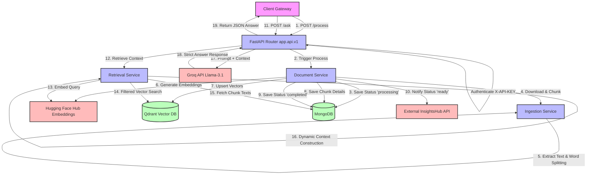

# InsightsHub RAG Service

A high-performance, stateless Retrieval-Augmented Generation (RAG) microservice built with **FastAPI**. This service handles document ingestion (downloading, parsing, chunking, and embedding), vector storage, similarity search, and context-aware question answering.

---

## 🚀 Key Features

*   **Multi-Format Document Parsing**: Out-of-the-box support for `PDF`, `DOCX`, `CSV`, `TXT`, and `JSON` files.
*   **Vector Search with Metadata Filtering**: Integrated with **Qdrant** to store and search embeddings with granular scope filters (`user_id`, `space_type`, `space_id`).
*   **Hybrid Storage Architecture**: Uses **MongoDB** for document/chunk metadata and **Qdrant** for vector search.
*   **Strict Context-Aware Answers**: Integrates **Groq (Llama 3.1 8B)** to generate precise answers based *only* on the retrieved document context.
*   **External Service Synchronisation**: Notifies a primary API gateway of document processing states (`processing`, `ready`, `failed`, `deleting`, `deleted`) via HTTP callbacks.
*   **Dockerized Development**: Easy setup with pre-configured container definitions for local development.

---

## 🛠️ Technology Stack

*   **Framework**: [FastAPI](https://fastapi.tiangolo.com/) (Python 3.11)
*   **Embedding Model**: Hugging Face Inference API (`sentence-transformers/all-MiniLM-L6-v2`, 384 dimensions)
*   **LLM Provider**: [Groq Cloud SDK](https://wow.groq.com/) (`llama-3.1-8b-instant`)
*   **Vector DB**: [Qdrant](https://qdrant.tech/) (Distance Metric: Cosine)
*   **Document DB**: [MongoDB](https://www.mongodb.com/) (using asynchronous `motor` driver)
*   **Text Parsers**: `pypdf`, `python-docx`
*   **HTTP Clients**: `requests` (sync), `httpx` (async)

---

## 📐 System Architecture & Flow



---

## 📂 Project Structure

```text
python-rag-service/
│
├── app/
│   ├── api/
│   │   └── v1/
│   │       ├── routes/
│   │       │   └── documents.py       # API Endpoint controllers (process, ask, status, delete)
│   │       └── router.py              # Root router for v1 API
│   │
│   ├── core/
│   │   ├── config.py                  # Pydantic Settings management (.env loader)
│   │   ├── mongo_async.py             # Asynchronous MongoDB Client configuration
│   │   └── vector_db.py               # Qdrant client, collections, upserts, & deletions
│   │
│   ├── schemas/
│   │   ├── document.py                # Request body schemas for documents (Process, Delete)
│   │   └── question.py                # Request body schemas for queries (AskQuestion)
│   │
│   ├── services/
│   │   ├── chunking.py                # Word-based sliding-window text chunker
│   │   ├── document_ingestion.py      # Format-specific parsers (PDF, DOCX, CSV, TXT, JSON)
│   │   ├── document_service.py        # Coordinator for database and ingestion states
│   │   ├── download_service.py        # External URL file downloader
│   │   ├── embedding_service.py       # Hugging Face inference integration
│   │   ├── llm_service.py             # Groq completion request wrapper
│   │   ├── node_api.py                # HTTP status update dispatcher to external gateway
│   │   └── retrieval_service.py       # Context search pipelines and context trimming
│   │
│   └── main.py                        # Service startup lifecycle and FastAPI configuration
│
├── .dockerignore
├── .env                               # Environment configurations (API keys, URIs)
├── .gitignore
├── Dockerfile                         # Production-ready slim Dockerfile
├── docker-compose.yml                 # Multi-container orchestration (Local dev reload)
└── requirements.txt                   # Project Python packages dependencies
```

---

## ⚙️ Configuration & Environment Variables

Create a `.env` file in the root directory. Here is the template for keys required by the service:

```ini
# Hugging Face Settings
HF_API_TOKEN=your_huggingface_api_token
HF_EMBED_MODEL=sentence-transformers/all-MiniLM-L6-v2

# MongoDB Database Settings
MONGO_URI=mongodb+srv://<user>:<password>@cluster.mongodb.net/rag_service_db?retryWrites=true&w=majority
MONGO_DB_NAME=rag_service_db

# Authorization Security Key for Endpoints
API_KEY=your_rag_service_secret_api_key

# Qdrant Vector DB Settings
QDRANT_URL=https://your-qdrant-instance-url.io
QDRANT_API_KEY=your_qdrant_api_key

# Groq LLM Settings
GROQ_API_KEY=gsk_your_groq_api_key
GROQ_MODEL=llama-3.1-8b-instant

# Primary API Gateway to Notify Status
API_SERVICE_URL=https://api.yourdomain.com
```

---

## 🔌 API Documentation

All API requests (except `/health` and `/`) require the authentication header:
`X-API-KEY: <your_rag_service_secret_api_key>`

### 1. Document Ingestion
* **Endpoint**: `POST /api/v1/documents/process`
* **Description**: Downloads the document, extracts text, chunks it, embeds it, and upserts metadata + vectors to databases. Runs asynchronously and dispatches progress updates to the `API_SERVICE_URL`.

**Request Headers**:
```http
X-API-KEY: your_rag_service_secret_api_key
Content-Type: application/json
```

**Request Body (`ProcessDocumentRequest`)**:
```json
{
  "document_id": "doc_abc123",
  "file_url": "https://example-bucket.s3.amazonaws.com/reports/financials.pdf",
  "user_id": "user_xyz789",
  "space_type": "personal", 
  "space_id": "space_123"
}
```
*Note: `space_type` must be `"personal"` or `"team"`.*

**Response**:
```json
{
  "message": "Processing completed"
}
```

---

### 2. Context-Aware Query (Ask)
* **Endpoint**: `POST /api/v1/documents/ask`
* **Description**: Executes similarity search over documents matched with workspace filters (`user_id`, `space_type`, `space_id`), retrieves the context, prompts Groq LLM, and retrieves a structured response.

**Request Body (`AskQuestionRequest`)**:
```json
{
  "question": "What was the company's Q3 revenue growth?",
  "user_id": "user_xyz789",
  "space_type": "personal",
  "space_id": "space_123"
}
```

**Response (Context Found)**:
```json
{
  "question": "What was the company's Q3 revenue growth?",
  "answer": "The company's Q3 revenue growth was 14.2% year-over-year, driven by cloud services.",
  "context_used": true
}
```

**Response (No Context Found)**:
```json
{
  "question": "What was the company's Q3 revenue growth?",
  "answer": "No relevant information found in your documents.",
  "context_used": false
}
```

---

### 3. Check Document Ingestion Status
* **Endpoint**: `GET /api/v1/documents/{document_id}/status`
* **Description**: Fetches document processing details and chunk count.

**Response**:
```json
{
  "document_id": "doc_abc123",
  "status": "completed",
  "chunk_count": 42,
  "created_at": "2026-06-11T06:00:00Z",
  "updated_at": "2026-06-11T06:01:15Z"
}
```

---

### 4. Delete Document
* **Endpoint**: `DELETE /api/v1/documents/{document_id}`
* **Description**: Deletes vectors from Qdrant, chunk mappings from MongoDB, and updates document status to `deleted`.

**Request Body (`DeleteDocumentRequest`)**:
```json
{
  "user_id": "user_xyz789",
  "space_type": "personal",
  "space_id": "space_123"
}
```

**Response**:
```json
{
  "message": "Document deleted successfully"
}
```

---

## 🛠️ Local Development & Setup

### Option 1: Using Docker Compose (Recommended)
This runs the FastAPI server with hot-reload enabled.

1. Ensure Docker is installed and running on your system.
2. Build and start the container:
   ```bash
   docker-compose up --build
   ```
3. The server will be accessible at: `http://localhost:8000`

### Option 2: Running Locally with Python Virtual Environment

1. **Create and Activate Environment**:
   ```bash
   python -m venv venv
   # On Windows:
   .\venv\Scripts\activate
   # On macOS/Linux:
   source venv/bin/activate
   ```
2. **Install Dependencies**:
   ```bash
   pip install -r requirements.txt
   ```
3. **Run Dev Server**:
   ```bash
   uvicorn app.main:app --host 0.0.0.0 --port 8000 --reload
   ```

---

## ⚙️ Ingestion & Retrieval Specs

*   **Chunking Config**: Word splitting with a default size of `200` words per chunk and a sliding overlap of `50` words.
*   **Vector Search Threshold**: Minimum cosine similarity score of `0.35` (configurable in `retrieval_service.py`). Hits below this value are discarded.
*   **Token Allocation System**:
    *   Model Context Limit: `8,192` tokens
    *   Answer Reserved Buffer: `1,200` tokens
    *   System Prompt & Question Buffer: `1,000` tokens
    *   Max Context Size: `5,992` tokens (estimated as ~`23,968` characters)
